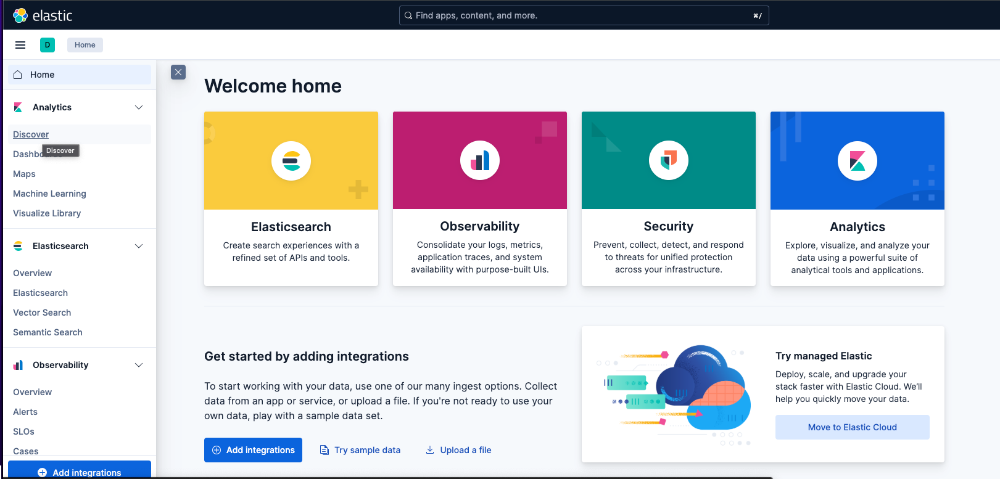

# kibana


## ElasticSearchとは
データを保存・検索・分析するための分散型検索エンジン

主な特徴
- 分散アーキテクチャ：複数のノードに分散してデータを保存・処理できるため、大量のデータを効率的に扱える
- リアルタイム検索：データの投入とほぼ同時に検索可能になる
- RESTful API：HTTPベースのAPIで簡単にデータの投入・検索ができる
- スキーマレス：事前にデータ構造を定義せずに柔軟にデータを格納できる
- 全文検索：高度な全文検索機能とフィルタリング機能を提供


## Kibana
KibanaはElasticsearchに格納されたデータを可視化・分析するためのWebベースのツールです。
主な機能
- データ可視化：グラフ、チャート、地図などでデータを視覚的に表現
- ダッシュボード：複数の可視化を組み合わせた監視画面を作成
- 検索・フィルタリング：直感的なUIでデータを検索・絞り込み
- リアルタイム監視：データの変化をリアルタイムで追跡
- アラート機能：特定の条件に基づいて通知を設定


## 用途

- データ収集：Logstashやbeatsがログやメトリクスを収集
- データ蓄積：Elasticsearchにデータを格納・インデックス化
- データ可視化：Kibanaでデータを分析・可視化

## RDBなどと比べた時の特徴
Elasticsearchは、特に大量の非構造化または半構造化テキストデータに対して、ユーザーが求める情報を高速かつ柔軟に探し出すことに特化したシステム。<br>
通常のデータベースがデータの厳密な管理と整合性を重視するのに対し、Elasticsearchは検索のパフォーマンスと多様な検索機能に重点を置いている。<br>
そのため、両者は異なる目的で利用され、多くのシステムでは両方を組み合わせて活用されてる。<br>
例えば、マスターデータはRDBに格納し、検索用のデータはElasticsearchに同期して全文検索を提供する、といった連携が一般的。

## 環境構築

`docker-compose up -d`で起動後、下記URLにアクセス。※少し時間がたったあとにアクセス<br>
http://localhost:5601/

## kibanaの操作
データ投入(実際にはログをこのようにみることが多い)
```
# 投入データ
curl -X POST "localhost:9200/sample-logs/_doc" \
  -H "Content-Type: application/json" \
  -d '{
    "timestamp": "'$(date -u +%Y-%m-%dT%H:%M:%S.%3NZ)'",
    "level": "INFO",
    "message": "Application started successfully",
    "service": "web-app",
    "host": "server01"
  }'

# レスポンス
{"_index":"sample-logs","_id":"pmmzA5gBDAT1gSav8rtQ","_version":1,"result":"created","_shards":{"total":2,"successful":1,"failed":0},"_seq_no":0,"_primary_term":1}

```
Analysis→Discover
　

クエリを入力後RUNを押下して、ログを表示。Table形式かJSON形式でログが見れる


※elastic Search生で見ることも可能

```
リクエスト
curl "localhost:9200/sample-logs/_search?size=5&sort=timestamp:desc"

レスポンス
{"took":2,"timed_out":false,"_shards":{"total":1,"successful":1,"skipped":0,"failed":0},"hits":{"total":{"value":1,"relation":"eq"},"max_score":null,"hits":[{"_index":"sample-logs","_id":"pmmzA5gBDAT1gSav8rtQ","_score":null,"_source":{
    "timestamp": "2025-07-13T12:13:01.3NZ",
    "level": "INFO",
    "message": "Application started successfully",
    "service": "web-app",
    "host": "server01"
  },"sort":[1752365581300]}]}}%   
```                                

## php-app
web上から確認できるアプリで、Monologをelastic-searchにログを流し込み


## phinx
公式 https://phinx.org/

設定ファイル作成
```
php ./vendor/bin/phinx init     
Phinx by CakePHP - https://phinx.org. 0.16.10

created /var/www/html/phinx.php

```

migrationファイル作成
```
php ./vendor/bin/phinx create Reviews
Phinx by CakePHP - https://phinx.org. 0.16.10

using config file phinx.php
using config parser php
using migration paths
 - /var/www/html/db/migrations
using seed paths
 - /var/www/html/db/seeds
using migration base class Phinx\Migration\AbstractMigration
using default template
created db/migrations/20251004050146_reviews.php
```

```
# マイグレーション実行
php vendor/bin/phinx migrate

# ロールバック
php vendor/bin/phinx rollback
```

状況把握
```
root@0793a7f44b41:/var/www/html# php ./vendor/bin/phinx status  
Phinx by CakePHP - https://phinx.org. 0.16.10

using config file phinx.php
using config parser php
using migration paths
 - /var/www/html/db/migrations
using seed paths
 - /var/www/html/db/seeds
warning no environment specified, defaulting to: development
ordering by creation time

 Status  [Migration ID]  Started              Finished             Migration Name 
----------------------------------------------------------------------------------
   down  20251004050146                                            Reviews
   down  20251004050246                                            Tags
   down  20251004050309                                            ReviewTags
```

seeder
```
php ./vendor/bin/phinx seed:run
Phinx by CakePHP - https://phinx.org. 0.16.10

using config file phinx.php
using config parser php
using migration paths 
 - /var/www/html/db/migrations
using seed paths 
 - /var/www/html/db/seeds
warning no environment specified, defaulting to: development
using adapter mysql
using database development_db

 == DummyData: seeding 
 == DummyData: seeded 0.0381s

All Done. Took 0.0501s
```

## 全文検索エンジンとしての登録
reviewインデックスへの登録(読み取り専用)<br>
登録処理
```
    public function syncReview(): void
    {
        $reviews = DB::table('reviews')
            ->select('reviews.*')
            ->get();

        foreach ($reviews as $review) {
            try {
                // オブジェクト型でないとESに入らないためここで
                $tags = DB::table('review_tags')
                    ->join('tags', 'review_tags.tag_id', '=', 'tags.id')
                    ->where('review_tags.review_id', $review->id)
                    ->select('tags.id', 'tags.tag_name')
                    ->get();

                // ElasticSearchに保存
                $this->client->index([
                    'index' => 'reviews',
                    'id' => $review->id,
                    'body' => [
                        'title' => $review->title ?? '',
                        'content' => $review->content ?? '',
                        'tags' => $tags->toArray(),
                        'created_at' => $review->created_at
                    ]
                ]);
            } catch (\Exception $e) {
                    echo "✗ レビューID {$review->id} の同期に失敗: {$e->getMessage()}\n";
            }
        }
    }


```

検索
```
    public function searchIndex(string $keyword)
    {
        // キーワードで検索して最初の1件を取得
        $response = $this->client->search([
            'index' => 'reviews',
            'body' => [
                'query' => [
                    'match' => [
                        'content' => $keyword
                    ]
                ],
                'size' => 1  // 1件だけ取得
            ]
        ]);
        return $response;
    }
```

## 全文検索エンジンとしてのElasticSearch

- 検索用のES(負荷軽減のための読み取り専用)
- 100万件以上のデータ
  - 大規模ECサイト（Amazon、楽天クラス）
  - ログ分析（1日数億レコード）
  - SNSの投稿検索
  - 大手ニュースサイト

RDBとの比較
|概念|RDB|ElasticSearch|
|--|--|--|
|データの保存場所|Table（テーブル）|Index（インデックス）|
|1件のデータ|Row（行）|Document（ドキュメント）|
|データ項目|Column（列）|Field（フィールド）|
|スキーマ定義|CREATE TABLE|Mapping|


## phinx
migrationライブラ入り<br>
https://qiita.com/macchaka/items/3decc5f48a15f00e188c
## 参考
https://qiita.com/KWS_0901/items/c300b5ee010cb48dbaa3<br>
https://qiita.com/wooooo/items/8be2c7e1ab75a7a54851
